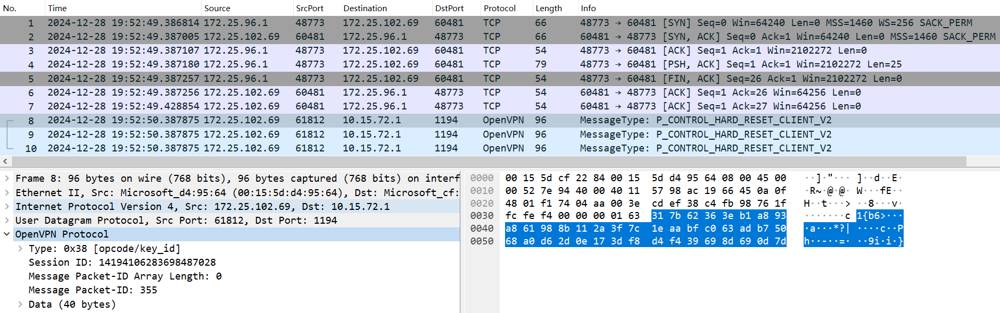

## I. Background
Recently, 360 Security Brain [1] detected a batch of botnet samples that integrate the XXTEA algorithm for encryption based on the leaked source code of Mirai, targeting IoT/Linux devices of various architectures such as ARM, MIPS, and x86.

## II. Sample Analysis

### 2.1 Mirai.CatDDoS
The first batch of captured samples is a variant of the Mirai botnet operated by the CatDDoS group. Taking the sample adda181984cda825dbfa1cb071a066f5 as an example, its source code basic structure is as follows:

- Source File: 'attack.c'
- Source File: 'attack_tcp.c'
- Source File: 'attack_udp.c'
- Source File: 'checksum.c'
- Source File: 'killer.c'
- Source File:'main.c'
- Source File: 'rand.c'
- Source File:'resolv.c'
- Source File: 'util.c
- Source File: 'watchdog.c'
- Source File: 'xxtea.c'

Compared with the leaked Mirai source code, Mirai.CatDDoS does not contain the scanner.c module used for Telnet brute force cracking, and replaces the table.c module used for XOR decryption of strings with 0xdeadbeef with the xxtea.c implementation. The 16-byte XXTEA algorithm key is:
78h 56h 34h 12h 21h 43h 65h  87h 68h 98h BAh DCh FEh


There are 3 cross-references in total. The first one is to decrypt the string output to the console after the sample runs, and the XXTEA decrypted result is "Hello, world!":

The other two are used to decrypt the C2 addresses contained in the sample, which are: retardedclassmate.dyn and servernoworky.geek. These two C2 addresses have appeared in the report [2] describing the recent attack activities of the CatDDoS group.


Since the C2 is an OpenNIC domain name and cannot be resolved via public DNS servers, the sample has hard-coded the OpenNIC DNS server used for C2 resolution:

```c++
unsigned int _fastcall get_dns(_int64 a1)
{
    unsigned int result;  // eax
    result = (unsigned int)rand_next(a1) % 11;
    switch (result)
    {
    case 0u:
        result = htonl(0xC30AC3C3);  // 195.10.195.195
        break;
    case 1u:
        result = htonl(0xC2249057);  // 194.36.144.87
        break;
    case 2u:
        result = htonl(0x33FEA23B);  // 51.254.162.59
        break;
    case 3u:
        result = htonl(0x5E1072FE);  // 94.16.114.254
        break;
    case 4u:
        result = htonl(0x339E6CCB);  // 51.158.108.203
        break;
    case 5u:
        result = htonl(0x334D958B);  // 51.77.149.139
        break;
    case 6u:
        break;
    case 7u:
        result = htonl(0xB2FE16A6);  // 178.254.22.166
        break;
    case 8u:
        result = htonl(0x51A988DE);  // 81.169.136.222
        break;
    case 9u:
        result = htonl(0x86C30402);  // 134.195.4.2
        break;
    case 10u:
        result = htonl(0x5BD98925);  // 91.217.137.37
        break;
    default:
        break;
    }
    return result;
}
```


The C2 port is randomly selected between 25596 and 25616. In terms of the communication mechanism, Mirai.CatDDoS basically follows the original design of Mirai, except that the fixed 4-byte \x00\x00\x00\x01 when Mirai goes online is modified to a fixed 8-byte:


In terms of the ATTACK_VECTOR, Mirai.CatDDoS implements a richer variety of DDoS attack types than Mirai. The comparison is as follows:


| Mirai |  | Mirai.CatDDoS |  |
|----|----|----|----|
| Serial Number | Attack Method | Serial Number | Attack Method |
| 0 | attack_udp_generic | 0 | attack_udp_plain |
| 1 | attack_udp_vse | 1 | attack_tcp_syn |
| 2 | attack_udp_dns | 2 | attack_tcp_stomp |
| 3 | attack_tcp_syn | 3 | attack_tcp_ack |
| 4 | attack_tcp_ack | 4 | attack_tcp_tcp |
| 5 | attack_tcp_stomp | 5 | attack_tcp_bypass |
| 6 | attack_gre_ip | 6 | attack_tcp_socket |
| 7 | attack_gre_eth | 7 | attack_udp_pps |
| 8 | attack_app_proxy | 8 | attack_tcp_ovh |
| 9 | attack_udp_plain | 9 | attack_gre_ip |
| 10 | attack_app_http | 10 | attack_udp_ovhhex |
|  |  | 11 | attack_udp_openvpn |
|  |  | 12 | attack_method_udprape |
|  |  | 13 | attack_udp_r6 |
|  |  | 14 | attack_tcp_ovhtest |


Based on relevant characteristics, we have associated a batch of similar samples. They are more concise and more similar to the original Mirai in terms of code function and structure design. It is speculated that they may be earlier bot versions. From the naming method of the C2, it conforms to the consistent style of the CatDDoS group - that is, having a special preference for "cats". The similarities and differences between the old and new versions are as follows:

|  | Old Version | New Version |
|--|--|--|
| Decryption Algorithm | ~ (XOR) | XXTEA |
| Secret Key | 0xDEADBEEF | 78 56 34 12 21 43 65 87<br>68 24 57 13 98 BA DC FE |
| C2 Addresses | catsarecool.gopher<br>ilikecats.parody<br>ihateyou.indy<br>catsliketo.pirate<br>kittycattoos.dyn | retardedclassmate.dyn<br>servernoworky.geek |
| Port | 9932 | Randomly selected from 25596 to 25616 |
| Bot Online | 00 00 00 01 | 31 73 13 93 04 83 32 04 |
| DDoS Commands | Integrated 15 attack methods including tcp, udp, etc. |

### 2.2 Traffic Analysis

We will conduct protocol analysis on several newly added attack commands in order to obtain effective traffic evasion rules.

#### Attack Command <11> attack_udp_openvpn

The sample sends attack packets to the target victim machine via the `send` function at the end of the `attack_udp_openvpn` function.


The sent data payload is the fixed memory content pointed to by `unk_211040`:

```markdown
38 C4 FB 98 76 1F FC FE F4 00 00 00 01 63 31 7B 62 36 3E B1 A8 93 A8 61 98 8B 11 2A 3F 7C 1E AA BF C0 63 AD B7 50 68 A0 D6 2D 0E 17 3D F8 D4 F4 39 69 8D 69 0D 7D 
```

We then captured the traffic generated by the sample in a controlled environment, and the generated data was consistent with our memory analysis:



I'll help you create a Suricata rule to detect UDP packets with that specific payload.

Here's the detection rule:

```suricata
alert udp any any -> any any (msg:"Detected specific UDP payload"; content:"|38 C4 FB 98 76 1F FC FE F4 00 00 00 01 63 31 7B 62 36 3E B1 A8 93 A8 61 98 8B 11 2A 3F 7C 1E AA BF C0 63 AD B7 50 68 A0 D6 2D 0E 17 3D F8 D4 F4 39 69 8D 69 0D 7D|"; sid:1000001; rev:1;)
```

#### 攻击命令 <12> attack_method_udprape

attack_method_udprape中没有和常规流量一致的特征，所不同的可能仅是随机值部分，所以我保守地没有给出匹配规则，但在样本程序中仍然显示有一些固定模式的字符串：


#### 攻击命令 <13> attack_udp_r6

attack_udp_r6函数同样在最后通过send攻击目标对象，执行时unk_211080位置的内存固定为：
```markdown
A5 E4 43 C7 00 3F 10 16 01 12 2F F8 3C E1 D0 5D 49 2A 43 A4 25 77 00 00 00 F2 60 25 D8 FF FF FF FF F4 6D 89 0B DC 36 47 F7 3A A5 38 8D 
```


截取的流量如下：


对应的规则为：

```suricata
alert udp any any -> any any (msg:"Detected specific UDP payload"; content:"|A5 E4 43 C7 00 3F 10 16 01 12 2F F8 3C E1 D0 5D 49 2A 43 A4 25 77 00 00 00 F2 60 25 D8 FF FF FF FF F4 6D 89 0B DC 36 47 F7 3A A5 38 8D|"; sid:1000002; rev:1;)
```

[1] https://mp.weixin.qq.com/s/AlmeQJVeWr2c1gf7yzo48w

[2] https://mp.weixin.qq.com/s/Hc_zHeByTdOvDZPGxQaxlw

[3] https://blog.xlab.qianxin.com/catddos-derivative-cn/